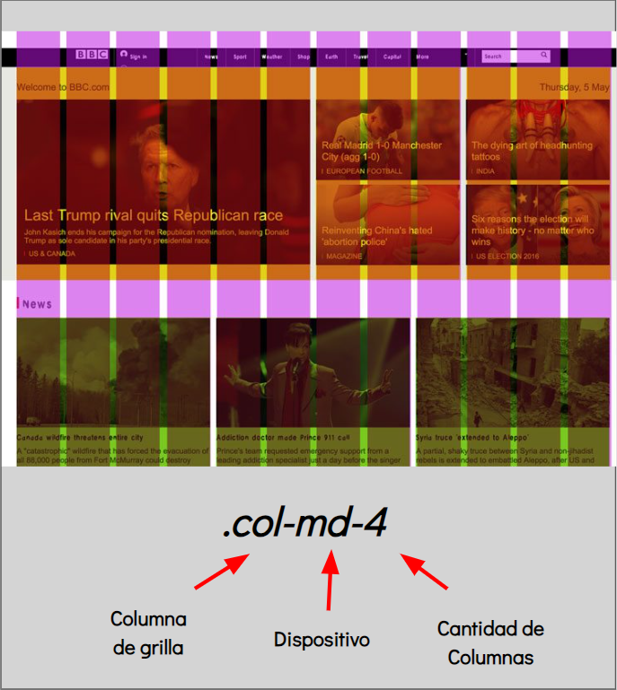
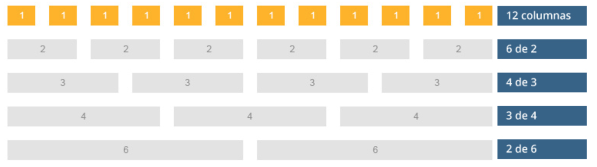
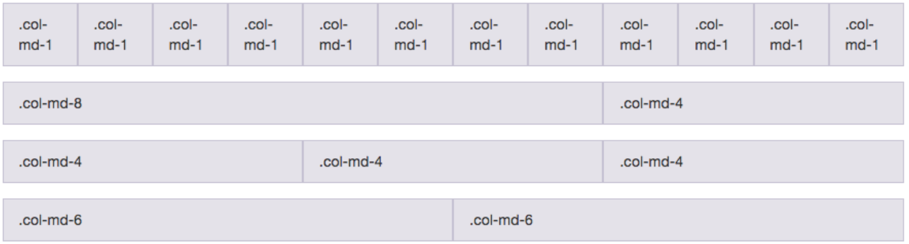

# BOOTSTRAP

<br>

**Bootstrap** es un framework originalmente creado por Twitter ('X'), que permite crear interfaces web con CSS y JavaScript, y cuya particularidad es la de adaptar la interfaz del sitio web al tamaño del dispositivo en que se visualice (es _responsive_).

> 🔗 Documentación de [Bootstrap](https://getbootstrap.com).

<br>

## Ventajas y Desventajas

Ventajas:

- Es genérica, permite simplificar el proceso de maquetación.
- Es responsive.
- Maquetar por columnas es fácil.
- Se integra muy bien con las principales librerías Javascript.
- Posee estilos predeterminados que pueden usar como base.

Desventajas:

- Adaptación, es más complicado personalizarlo.
- Mucho CSS que no se usará.
- Mucho uso de clases.
- Añadir componentes.
- Mantenimiento, si has hecho muchos cambios.

<br>

## Compatibilidad

Nunca debes pasar por alto la comprobación acerca de si la tecnología que estás aplicando es compatible con los navegadores más usados por los usuarios que visitarán tu sitio.

> 🔗 [Navegadores compatibles](https://getbootstrap.com/docs/5.3/getting-started/browsers-devices/) con Bootstrap.

<br>

## Instalación

Existen diferentes formas de utilizar BS:

1. Código compilado.
2. Archivos para compilar.
3. BootstrapCDN (enlace directo).
4. Instalando paquetes.

Vamos a usar las formas más sencillas:

1. Descargando los archivos.
2. Con el enlace a los archivos.

> 🚨 **IMPORTANTE**: Para garantizar una representación adecuada, y un zoom táctil para todos los dispositivos, no olvides agregar el viewport: `<meta name="viewport" content="width=device-width, initial-scale=1">`.

<br>

## Herramientas

Sus principales herramientas/partes que lo conforman son:

1. **Grid System**: Un sistema de cuadrícula que permite organizar el contenido en filas y columnas. Utiliza un diseño flexible que se adapta a diferentes tamaños de pantalla.

2. **Components (Componentes)**: Incluye elementos como botones, formularios, tarjetas, navbars, alertas, modales y mucho más. Cada componente viene con estilos predeterminados y funcionalidades interactivas.

3. **JavaScript Plugins**: Bootstrap incluye varios plugins de JavaScript para añadir interactividad, como modales, carruseles, pestañas y tooltips. Estos se basan en `jQuery`.

4. **Utilities (Utilidades)**: Clases de utilidad que permiten aplicar estilos rápidamente, como márgenes, padding, colores y ocultar elementos en diferentes tamaños de pantalla.

5. **Typography**: Estilos de texto predefinidos que ayudan a crear una tipografía coherente y atractiva.

6. **Forms**: Estilos y estructuras para crear formularios, incluyendo controles como campos de texto, botones de opción, listas desplegables, entre otros.

<br>

## Estructura / Sistema de Grillas

Bootstrap posee un sistema de grillas para organizar su contenido. La `grilla` se divide en _12 columnas_, que varían su ancho dependiendo de la resolución del usuario móvil, o de escritorio.

> 🔗 Documentación del [Sistema de Grillas](https://getbootstrap.com/docs/5.3/layout/grid/).

<center>

</center>

Estas columnas se ubican siempre dentro de una _fila_, el cual debe ser un contenedor (puede ser un `div`) que lleve la clase `row`.

Se representan como `col-md-x` e indican que el `div` ocupará _X_ columnas dentro de un `.container`.

<center>

</center>

<center>

</center>

Si quisiéramos que un mismo `div` ocupe _6 columnas_ en un dispositivo _X_ y _3 columnas_ en un dispositivo _Y_, deberíamos aplicarle dos clases, para indicarle un comportamiento para cada resolución.

Entonces, podemos nombrar un `div` con dos clases diferentes, que proporcionarán distintos estilos al mismo elemento.

```html
<div class="col-md-4 col-sm-6"></div>
```

Eso no será ningún problema, ya que sólo se cargarán los estilos que correspondan según el dispositivo que está renderizando la página en ese momento, ya que funcionan con `media queries`.

> 🔗 Para saber las medidas utilizadas en Bootstrap para las `media queries`, podemos verificar sus [Breakpoints](https://getbootstrap.com/docs/5.3/layout/breakpoints/).

<br>

## ¡Demo Práctica!

En primer lugar, crearemos la estructura básica de un Doc HTML:

```html
<!DOCTYPE html>
<html>
  <head>
    <meta charset="UTF-8" />
    <meta name="viewport" content="width=device-width,initial-scale=1" />
    <title>Demo 2</title>
  </head>
  <body></body>
</html>
```

Y luego sumaremos la importación de _Bootstrap_. 🔗 Se puede hacer siguiendo los pasos de este [enlace](https://getbootstrap.com/docs/5.3/getting-started/introduction/):

```html
<!DOCTYPE html>
<html lang="en">
  <head>
    <meta charset="utf-8" />
    <meta name="viewport" content="width=device-width, initial-scale=1" />
    <title>Demo 2</title>
    <!-- CSS -->
    <link
      href="https://cdn.jsdelivr.net/npm/bootstrap@5.3.1/dist/css/bootstrap.min.css"
      rel="stylesheet"
      integrity="sha384-4bw+/aepP/YC94hEpVNVgiZdgIC5+VKNBQNGCHeKRQN+PtmoHDEXuppvnDJzQIu9"
      crossorigin="anonymous"
    />
  </head>
  <body>
    <h1>Hello, world!</h1>
    <!-- JS -->
    <script
      src="https://cdn.jsdelivr.net/npm/bootstrap@5.3.1/dist/js/bootstrap.bundle.min.js"
      integrity="sha384-HwwvtgBNo3bZJJLYd8oVXjrBZt8cqVSpeBNS5n7C8IVInixGAoxmnlMuBnhbgrkm"
      crossorigin="anonymous"
    ></script>
  </body>
</html>
```

🔗 En la [página de Bootstrap](https://getbootstrap.com/) podrán encontrar muchos componentes que pueden reutilizar en sus páginas web.

Siguiendo con el ejemplo, supongamos que queremos crear una grilla con columnas, usando _Bootstrap_.

1. 🔗 Lo primero que debemos hacer es crear el contenedor de nuestra grilla, eso lo haremos con un [container](https://getbootstrap.com/docs/5.3/layout/containers/):

```html
<div class="container">
  <!-- Content here -->
</div>
```

```css
.container {
  border: 1px solid blue;
  padding: 5px;
}
```

2. 🔗 Luego, por cada fila de elementos, debemos crear una `row`, de la misma forma que nos muestran en la [doc de las grillas](https://getbootstrap.com/docs/5.3/layout/grid/):

```html
<div class="container">
  <div class="row">
    <!-- Content here -->
  </div>
  <div class="row">
    <!-- Content here -->
  </div>
</div>
```

```css
.row {
  border: 1px solid red;
  padding: 5px;
}
```

3. Por último, por cada columna, debemos crear una `col`:

```html
<div class="container">
  <div class="row">
    <div class="col">Una de tres columnas</div>
    <div class="col">Una de tres columnas</div>
    <div class="col">Una de tres columnas</div>
  </div>
  <div class="row">
    <div class="col">Una de tres columnas</div>
    <div class="col">Una de tres columnas</div>
    <div class="col">Una de tres columnas</div>
  </div>
</div>
```

```css
.column {
  border: 1px solid green;
  padding: 5px;
}
```

Ahora, supongamos que queremos cambiar la cantidad de columnas que se muestren en función de la pantalla para que nos queden cuatro columnas en pantallas grandes, dos en medianas y una en pequeñas:

- Podríamos realizarlo con `CSS Media Queries`.
- O, podemos realizarlo usando _Bootstrap_ y sus grillas.

<br>

## Bootstrap Grid System

_Bootstrap_ ya tiene integrado un _sistema de grillas_ implementado a partir de `flexbox` que nos va a facilitar la tarea. Para ello utiliza seis clases ya definidas.

> 🔗 Puedes encontrarlas [acá](https://getbootstrap.com/docs/5.3/layout/grid/#grid-options).

El sistema de grilla de Bootstrap permite colocar hasta una suma de 12 'espacios' por fila distribuyéndolos de la forma que se quiera, ya sea colocando 12 columnas de 1 'espacio', 2 columnas de 6 'espacios' o cualquier variante de combinaciones:

Para nuestro ejemplo, haremos que en dispositivos `small` cada columna ocupe 12 espacios, en dispositivos `medium` unos 6 espacios y en dispositivos `large` unos 4 espacios, haciendo uso de las clases: `col-sm-12 col-md-6 col-lg-4`.

> También existe la opción de dejar que _Bootrstap_ identifique la cantidad de columnas que hay y a partir de ello le asigne el mismo ancho a cada una hasta completar la totalidad de la fila (Siempre recordando que el máximo es de 12). Para ello se utiliza simplemente la clase `.col` en cada columna.

Utilizando simplemente esas clases podemos crear múltiples tipos de grillas que se adapten a nuestras pantallas.

<br>
<hr>

<div align="center">
<a href="./frameworks.md">⬅️ Frameworks CSS</a>
	&#160;	&#160;	&#160;	&#160;	&#160;	🔸  &#160;	&#160;	&#160;	&#160;	&#160;
<a href="">Pseudo-Clases ➡️</a>
</div>