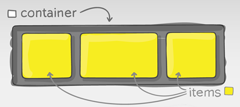
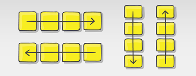
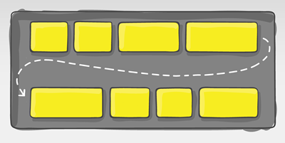
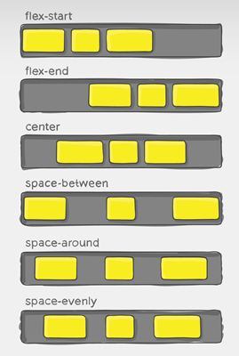
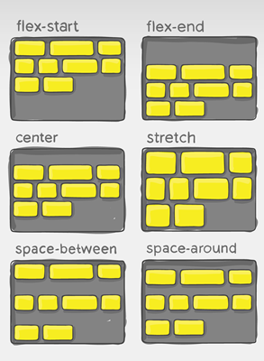
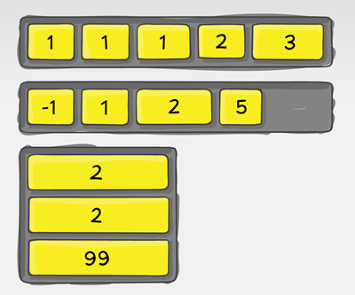

# FLEXBOX

<br>

## Definición y Usos

`Flexbox` es un _modo de diseño_ que nos permite crear estructuras para sitios web de una forma más fácil. Podrás posicionar un elemento en la posición que desees horizontalmente y por si fuera poco también en forma vertical. 

Además, no solo puedes posicionar elementos vertical y horizontalmente, sino que puedes establecer cómo se distribuirán, el orden que tendrán e incluso el tamaño que tendrán en proporción a otros elementos. Esto es perfecto para crear diseños adaptables a dispositivos móviles (Responsive Design).
	
`Flexbox` no es una propiedad ni un conjunto de propiedades. `Flexbox` es un nuevo _modelo de layout_ que viene a incorporarse a los ya existentes en CSS y sustituye los modelos anteriores como:

- **Block:** Los elementos aparecen uno debajo de otro ocupando todo el ancho disponible.
- **Inline:** Los elementos aparecen uno al lado del otro en una línea y saltan a la línea siguiente al ocupar el espacio disponible.
- **Table:** Los elementos imitan la distribución de una tabla HTML, con filas, encabezados y columnas.
- **Positioned:** Los elementos pueden romper el flujo y posicionarse en cualquier lugar del documento.

En fin, debemos saber que un _modelo de layout_ es un _set de algoritmos_ que determinan el tamaño y la posición de los elementos con respecto a sus hermanos y ancestros.

<br>

### Entonces, ¿Qué se puede hacer con flexbox?

Entendiendo lo que significa un _modelo de layout_, con `Flexbox` podemos hacer lo siguiente:

- Distribuir los elementos en sentido vertical u horizontal.
- Reordenar la aparición de los elementos sobreescribiendo su aparición en el navegador.
- Ajustar dinámicamente las dimensiones de los elementos para evitar desbordamientos (`overflow`) respecto a su padre.
- Redefinir el sentido del flujo de los elementos (hacia arriba, hacia abajo, hacia la izquierda o hacia la derecha).
- Alinear los elementos respecto al padre o respecto a sus hermanos.

<br>

## Conceptos básicos de Flexbox

Para entender bien este modelo de Layout debemos de entender algunos conceptos básicos. Primero la disposición `flex` debe de estar constituida por elementos padres e hijos, el padre será el contenedor Flexible (`flex container`) y los hijos inmediatos serán los elementos Flexibles (`flex item`).

<div align="center">
	
</div>

<br>

### ¿Cómo empezamos con Flexbox?

Para comenzar a utilizar Flexbox lo primero que debemos hacer es establecer la propiedad `display` con el valor `flex` en el elemento padre. `display: flex` es la única propiedad que necesitamos para configurar el contenedor principal y de esta manera todos sus hijos inmediatos se convertirán en elementos flexibles de forma automática.

```css
.flex-container {
	display: flex;
}
```

<br>

## Propiedad flex-direction

Esta propiedad me va a permitir manejar el direccionamiento de los flex items, nos va a permitir especificar si queremos que los flex items se dispongan en filas o columnas.

- Sus posibles valores son: `row`, `row-reverse`, `column`, `column-reverse`.

<div align="center">
	
</div>

```css
.flex-container {
	display: flex;
	flex-direction: row;
}
```

> 🔗 Puedes probar su funcionamiento [aquí](https://developer.mozilla.org/en-US/docs/Web/CSS/flex-direction).

<br>

## Propiedad flex-wrap

El comportamiento inicial del contenedor flexible es poder mantener los flex items en su eje horizontal sin importar que las dimensiones de estos ítems cambien, pero hay ocasiones donde vamos a querer controlar este alineamiento y hacer que los elementos puedan saltar de línea para poder mantener una apariencia deseada en estos flex items. Con `flex-wrap` vamos a poder especificar si queremos que los ítems puedan saltar a una nueva línea si el contenedor flexible se queda sin espacio.

- Sus posibles valores son: `wrap`, `wrap-reverse`, `nowrap`.

<div align="center">
	
</div>

```css
.flex-container {
	display: flex;
	flex-wrap: nowrap;
}
```

> 🔗 Puedes probar su funcionamiento [aquí](https://developer.mozilla.org/en-US/docs/Web/CSS/flex-wrap).

<br>

## Propiedad justify-content

`justify-content` nos va a permitir alinear los elementos en el eje horizontal de la línea actual del contenedor flexible, esto puede ser de forma vertical o horizontal según lo especifiquemos con `flex-direction`, también nos va a ayudar a distribuir los flex items en el contenedor flexible cuando los ítems no utilicen todo el espacio disponible en su eje principal actual. Esto es declarar la forma en que el navegador debe distribuir el espacio disponible entre los ítems flexibles.

- Sus valores más utilizados son: `flex-start`, `flex-end`, `center`, `space-between`, `space-around`, `space-evenly`.

<div align="center">
	
</div>

```css
.flex-container {
	display: flex;
	justify-content: flex-start;
}
```

> 🔗 Puedes probar su funcionamiento [aquí](https://developer.mozilla.org/en-US/docs/Web/CSS/justify-content). Esta misma propiedad se utiliza para CSS Grids, por lo cual verás en el ejemplo de la demo que se está utilizando para varias filas y columnas, pero la distribución y comportamiento de los elementos sigue siendo la misma. 

<br>

## Propiedad align-items

`align-items` nos permite establecer la alineación que tendrán por defecto los flex items, es similar a la propiedad `justify-content` pero esta vez la dirección es perpendicular. Es decir, `align-items` nos va a permitir organizar los ítems en el eje secundario del contenedor flex.

- Sus valores más utilizados son: `stretch`, `flex-start`, `flex-end`, `center`, `baseline`.

<div align="center">
	
</div>

```css
.flex-container {
	display: flex;
	align-items: flex-start;
}
```

> 🔗 Puedes probar su funcionamiento [aquí](https://developer.mozilla.org/en-US/docs/Web/CSS/align-items). Esta misma propiedad se utiliza para CSS Grids, por lo cual verás en el ejemplo de la demo que se está utilizando para varias filas y columnas, pero la distribución y comportamiento de los elementos sigue siendo la misma. 

<br>

## Propiedad align-content

La propiedad `align-content` alinea los flex items cuando estos no usan todo el espacio disponible en el eje vertical del contenedor flexible.

- Sus valores más utilizados son: `stretch`, `flex-start`, `flex-end`, `center`, `space-between`, `space-around`, `space-evenly`.

> Esta propiedad sólo tiene efecto cuando el contenedor flexible tiene varias líneas de flex items. Si se colocan en una sola línea esta propiedad no tiene ningún efecto sobre el diseño.

<div align="center">
	
</div>

```css
.flex-container {
	display: flex;
	align-content: flex-start;
}
```

> 🔗 Puedes probar su funcionamiento [aquí](https://developer.mozilla.org/en-US/docs/Web/CSS/align-content). Esta misma propiedad se utiliza para CSS Grids, por lo cual verás en el ejemplo de la demo que se está utilizando para varias filas y columnas, pero la distribución y comportamiento de los elementos sigue siendo la misma. 

<br>

## Propiedad order

Esta propiedad permite modificar el orden de aparición de un elemento. Recibe como valor números enteros positivos o negativos. Su valor por default es `1`.

<div align="center">
	
</div>

```css
.flex-item {
	display: flex;
	order: -1;
}
```

> 🔗 Puedes probar su funcionamiento [aquí](https://developer.mozilla.org/en-US/docs/Web/CSS/order).

<br>
<hr>

<div align="center">
<a href="./grids.md">CSS Grids ➡️</a>
</div>