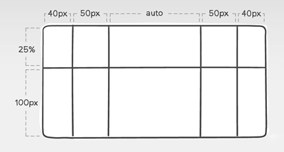
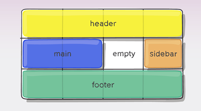
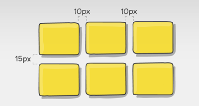
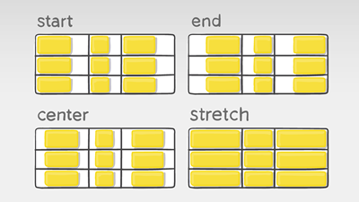
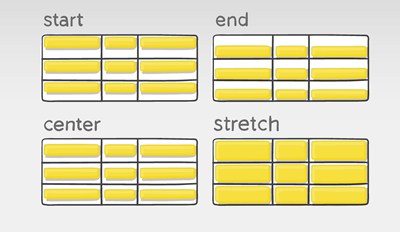
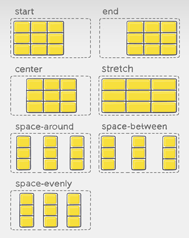
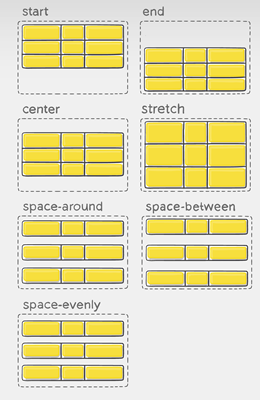
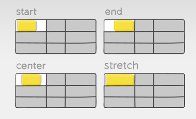
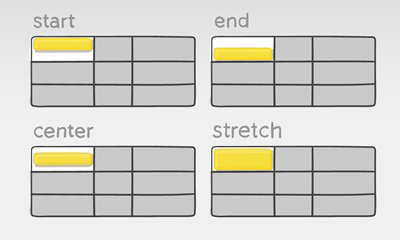

# CSS Grids

<br>

## Definición y Usos

`CSS Grid Layout` contiene funciones de diseño dirigidas a los desarrolladores de aplicaciones web. Se puede utilizar para lograr muchos diseños diferentes y se destaca por dividir una página en regiones principales, o definir la relación en términos de tamaño, posición y capas entre partes de un control.

El `grid layout` permite alinear elementos en _columnas y filas_, sin embargo, son posibles más diseños con `CSS grid` que como lo eran con las tablas que poseen las mismas alineaciones. 

`CSS Grid` es el sistema de maquetación más potente que hay disponible. Se trata de un sistema en 2D que nos permite definir filas y columnas (a diferencia de, por ejemplo, Flexbox, el cual funciona en una única dimensión, en una fila o en una columna). 

<br>

### Conceptos de base

`Grid` toma la filosofía y la base del sistema `Flexbox`. Para comenzar con `Grid` necesitamos tener en cuenta una serie de conceptos que utilizaremos:

- **Contenedor:** Elemento padre que definirá la cuadrícula.
- **Ítem:** Los hijos que contiene la cuadrícula (Contenedor).
- **Celda (`grid cell`):** Unidad mínima de la cuadrícula.
- **Área (`grid area`):** Región de celdas de la cuadrícula.
- **Banda (`grid track`):** Banda horizontal o vertical de celdas dentro de la cuadrícula.
- **Línea (`grid line`):** Separador entre las celdas de la cuadrícula.

<br>

## Implementar Grids

Activamos la cuadrícula Grid utilizando, sobre el elemento contenedor, la propiedad `display` con el valor `grid` o `inline-grid`. Esto influye en cómo se comportará la cuadrícula con el exterior. El primero de ellos permite que la cuadrícula aparezca encima/debajo del contenido exterior (en bloque) y el segundo de ellos permite que la cuadrícula aparezca a la izquierda/derecha (en línea) del contenido exterior.

```css
.grid-container {
	display: grid;
}
```

<br>

### Filas y columnas explícitas

Es posible crear cuadrículas con un tamaño definido. Para ello, sólo tenemos que usar las propiedades CSS `grid-template-columns` y `grid-template-rows`, sirven para indicar las dimensiones de cada celda de la cuadrícula, diferenciando entre columnas y filas.	

- **Propiedad `grid-template-columns`:** Establece el tamaño de las columnas (eje horizontal). 🔗 Puedes probar su funcionamiento [aquí](https://developer.mozilla.org/en-US/docs/Web/CSS/grid-template-columns).
- **Propiedad `grid-template-rows`:** Establece el tamaño de las filas (eje vertical). 🔗 Puedes probar su funcionamiento [aquí](https://developer.mozilla.org/en-US/docs/Web/CSS/grid-template-rows). 

- Sus posibles valores son: - numéricos - (acompañados de la unidad de medida y combinables entre sí), y `auto` (obtiene el tamaño restante de la columna o fila y lo divide en partes iguales según cuántas veces ha sido utilizado).

<div align="center">
	
</div>

```css
.grid-container {
	display: grid;
	grid-template-columns: 40px 50px auto 50px 40px;
	grid-template-rows: 25% 100px;
}
```

<br>

### Filas y columnas repetitivas

En las propiedades `grid-template-columns` y `grid-template-rows` podemos indicar expresiones de repetición, indicando celdas que repiten un mismo patrón de celdas varias veces, utilizando la función: `repeat([núm de veces], [valor o valores])`.

```css
.grid-container {
	display: grid;
	grid-template-columns: repeat(2, 100px);
	grid-template-rows: repeat(2, 50px);
}
```

> En este ejemplo se crea una cuadrícula de 2x2 donde las columnas van a tener un ancho de 100px y las filas van adoptar una altura de 50px.

<br>

## Grid por áreas

Es posible indicar el nombre y la posición concreta de cada área de la cuadrícula utilizando la propiedad `grid-template-areas`, donde debemos especificar el orden de las áreas, y luego, en cada ítem hijo, utilizamos la propiedad `grid-area` para indicar el nombre del área del que se trata. Cada conjunto de palabras escritas entre comillas (`“ ”`) en la propiedad `grid-template-areas` representará una fila en la grilla, indicando en cada una de las celdas de esa fila que elemento la ocupará.

De esta forma, es muy sencillo crear una cuadrícula altamente personalizada en apenas unas cuantas líneas de CSS.

En la propiedad `grid-template-areas` también podemos indicar una palabra clave especial:

- **La palabra clave `none`:** Indica que no se colocará ninguna celda en esta posición.
- **Uno o más puntos (`.`):** Indica que se colocará una celda vacía en esta posición.

<div align="center">
	
</div>

```html
<!-- HTML -->

<body>
	<header>...</header>
	<main>...</main>
	<aside>...</aside>
	<footer>...</footer>
</body>
```

```css
/* CSS */

header {
	grid-area: header;
}

main {
	grid-area: main;
}

aside {
	grid-area: sidebar;
}

footer {
	grid-area: footer;
}

.grid-container {
	display: grid;
	grid-template-columns: repeat(4, auto);
	grid-template-rows: repeat(3, auto);
	grid-template-areas:
		"header header header header"
		"main main . sidebar"
		"footer footer footer footer";
}
```

> 🔗 Puedes probar su funcionamiento [aquí](https://developer.mozilla.org/en-US/docs/Web/CSS/grid-template-areas).

<br>

## Grid espacios o gap

La cuadrícula tiene todas sus celdas una a continuación de la otra. Aunque sería posible darle un margen a las celdas dentro del contenedor, existe una forma más apropiada, evitando los problemas clásicos de los modelos de caja: los huecos (`gutters`).

- **Propiedad `column-gap`:** Establece el tamaño de los espacios entre columnas (eje horizontal). 🔗 Puedes probar su funcionamiento [aquí](https://developer.mozilla.org/en-US/docs/Web/CSS/column-gap).
- **Propiedad `row-gap`:** Establece el tamaño de los espacios entre filas (eje vertical). 🔗 Puedes probar su funcionamiento [aquí](https://developer.mozilla.org/en-US/docs/Web/CSS/row-gap). 

<div align="center">
	
</div>

```css
.grid-container {
	display: grid;
	grid-template-columns: repeat(3, auto);
	grid-template-rows: repeat(2, auto);
	column-gap: 10px;
	row-gap: 15px;
}
```

<br>

## Posición de elementos

Existen propiedades que se pueden utilizar para colocar los ítems dentro de la cuadrícula en ciertas posiciones específicas. 

Podemos distribuir los elementos de una forma muy sencilla y cómoda, utilizando `justify-ítems` y `align-items`, que ya conocemos de **Flexbox**.

Por otro lado, también podemos utilizar las propiedades `justify-content` o `align-content` para cambiar la distribución de todo el contenido en su conjunto.

<br>

### Propiedad justify-items

Distribuye los elementos en el eje horizontal dentro de cada una de sus celdas.

- Sus posibles valores son: `start`, `end`, `center`, `stretch`.

<div align="center">
	
</div>

```css
.grid-container {
	display: grid;
	grid-template-columns: repeat(3, auto);
	grid-template-rows: repeat(3, auto);
	justify-items: start;
}
```

> 🔗 Puedes probar su funcionamiento [aquí](https://developer.mozilla.org/en-US/docs/Web/CSS/justify-items).

<br>

### Propiedad align-items

Distribuye los elementos en el eje vertical dentro de cada una de sus celdas.

- Sus posibles valores son: `start`, `end`, `center`, `stretch`.

<div align="center">
	
</div>

```css
.grid-container {
	display: grid;
	grid-template-columns: repeat(3, auto);
	grid-template-rows: repeat(3, auto);
	align-items: start;
}
```

> 🔗 Puedes probar su funcionamiento [aquí](https://developer.mozilla.org/en-US/docs/Web/CSS/align-items).

<br>

### Propiedad justify-content 

Distribuye los elementos en conjunto en el eje horizontal dentro del grid container.

- Sus posibles valores son: `start`, `end`, `center`, `stretch`, `space-around`, `space-between`, `space-evenly`.

<div align="center">
	
</div>

```css
.grid-container {
	display: grid;
	grid-template-columns: repeat(3, auto);
	grid-template-rows: repeat(3, auto);
	justify-content: start;
}
```

> 🔗 Puedes probar su funcionamiento [aquí](https://developer.mozilla.org/en-US/docs/Web/CSS/justify-content).

<br>

### Propiedad align-content 

Distribuye los elementos en conjunto en el eje vertical dentro del grid container.

- Sus posibles valores son: `start`, `end`, `center`, `stretch`, `space-around`, `space-between`, `space-evenly`.

<div align="center">
	
</div>

```css
.grid-container {
	display: grid;
	grid-template-columns: repeat(3, auto);
	grid-template-rows: repeat(3, auto);
	align-content: start;
}
```

> 🔗 Puedes probar su funcionamiento [aquí](https://developer.mozilla.org/en-US/docs/Web/CSS/align-content).

<br>

## Propiedades de ítems

Hasta ahora hemos visto propiedades CSS que se aplican solamente al contenedor padre de una cuadrícula. Ahora vamos a ver ciertas propiedades que se aplican a cada ítem hijo de la cuadrícula, para alterar o cambiar el comportamiento específico de dicho elemento.

<br>

### Propiedad justify-self

Altera la justificación del ítem hijo en el eje horizontal.

- Sus posibles valores son: `start`, `end`, `center`, `stretch`.

<div align="center">
	
</div>

```css
.grid-item {
	justify-self: start;
}
```

> 🔗 Puedes probar su funcionamiento [aquí](https://developer.mozilla.org/en-US/docs/Web/CSS/justify-self).

<br>

### Propiedad align-self
Altera la alineación del ítem hijo en el eje vertical.

- Sus posibles valores son: `start`, `end`, `center`, `stretch`.

<div align="center">
	
</div>

```css
.grid-item {
	align-self: start;
}
```

> 🔗 Puedes probar su funcionamiento [aquí](https://developer.mozilla.org/en-US/docs/Web/CSS/align-self).

<br>
<hr>

<div align="center">
<a href="./flexbox.md">⬅️ Flexbox</a>
	&#160;	&#160;	&#160;	&#160;	&#160;	🔸  &#160;	&#160;	&#160;	&#160;	&#160;
<a href="./frameworks.md">Frameworks CSS ➡️</a>
</div>