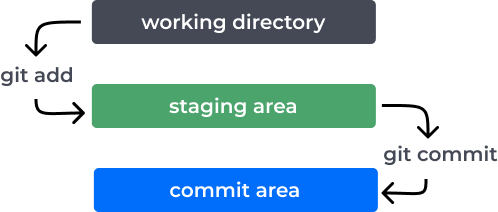

# Control de versiones: Git / GitHub

`Git` es un sistema de control de versiones que nos permite gestionar y realizar un seguimiento de los cambios en el código. Es especialmente útil para trabajar en equipo, ya que permite que múltiples desarrolladores colaboren en un proyecto sin conflictos.

`GitHub` es una plataforma que permite almacenar repositorios Git en la nube. Ofrece herramientas para colaborar, gestionar proyectos y compartir código con otros desarrolladores.

## Instalación y configuración

- **Windows**: Descarga e instala desde [git-scm.com](https://git-scm.com/download/win).
- **macOS**: Usa Homebrew: `brew install git`.
- **Linux**: Usa tu gestor de paquetes, por ejemplo: `sudo apt install git`.

Para verificar que Git se haya instalado correctamente vamos a abrir **Git Bash** y utilizar los comandos:

```bash
git
git -v
git --version
```

Luego debemos configurar nuestra identidad. Para esto, recomendamos utilizar tu nombre de usuario y correo electrónico con el que te registraste en Github, ya que esos son los datos que aparecerán como los de "autor" del código:

```bash
git config --global user.name "TuNombre"
git config --global user.email tuemail@example.com
```

Podemos comprobar si se guardo correctamente de esta forma:

```bash
git config --list
git config user.name
git config user.email
```

Si necesitas consultar el manual de Git lo podes hacer utilizando los comandos:

```bash
git help config
git config --help
```

## Creamos un repositorio

### En Github

1. Inicia sesión en tu cuenta de GitHub.
2. Haz clic en el botón "+" en la esquina superior derecha y selecciona "New repository".
3. Dale un nombre a tu repositorio y, opcionalmente, una descripción.
4. Elige si quieres que sea público o privado.
5. Haz clic en "Create repository".

### En nuestra PC

Para inicializar un repositorio local, accedemos a su directorio contenedor y usamos:

```bash
git init
```

> Este comando creará un archivo oculto `.git` donde se guardarán las versiones de nuestro proyecto.

## Estados de archivos y creación de versiones

<center>
  
</center>

Para agregar archivos al repositorio, usamos:

```bash
git add nombre-del-archivo.html
git add .
```

Para realizar un commit generando una nueva versión del proyecto, usamos:

```bash
git commit -m "Descripción de los cambios realizados"
```

Para ver el estado del repositorio, en cualquier momento, podemos usar:

```bash
git status
```

Si necesitamos ver el historial de cambios/commits:

```bash
git log
git log --oneline
```

Una vez que hayas hecho commits, debemos enlazar el repositorio local con el remoto (el de Github) con este comando:

```bash
git remote add origin https://github.com/tuusuario/tu-repositorio.git
```

Y sube tus cambios a GitHub utilizando:

```bash
git push -u origin main/master
```

> **Nota**: Asegúrate de que la rama `main` sea la correcta (puede ser `master` u otra, dependiendo de la configuración).

### Actualizar contenido de un repositorio

Entonces, según lo visto, cada vez que actualicemos nuestro repositorio, deberemos utilizar los siguientes comandos:

1. `git add .`
2. `git commit -m "Mensaje descriptivo"`
3. `git push`

### Borrar un repositorio

En Github se borran los repositorios mediante su pestaña _Settings_.

Pero si quisieramos borrar el historial de versiones de un repositorio en nuestra computadora, deberíamos borrar el archivo `.git` que lo guarda con el comando:

```bash
rm -rf .git
```

## Inicio de sesión en Github al pushear

Si es la primera vez que intentas hacer un `push`, seguramente Github te pida que inicies sesión. Hay varias formas de hacerlo, dependiendo de la configuración de tu computadora se iniciará un método distinto.

En el caso de que intentes iniciar sesión con tu password y te indique que es incorecta, probablemente necesites utilizar un `token`.

Para conseguirlo debes acceder a:

- `Settings` > `Developer Settings` > `Personal Access Tokens` > `Tokens (classic)` > `Generate New Token (classic)`

Podemos darle una descripción que identifique su uso, un tiempo de expiración/caducidad, y por último debemos darle los permisos necesarios para poder manipular, mínimamente, los repositorios.

Al crear el token, hagan una copia y guárdenlo en un lugar seguro, ya que solo se podrá ver 1 vez, luego deberán crear uno nuevo.

Teniendo un `token`, solo basta con utilizarlo en lugar de la password al momento de iniciar sesión.

## Colaboración en Proyectos

<center>
  
</center>

### Clonar un repositorio

En la terminal, usa el siguiente comando para clonar el repositorio:

```bash
git clone https://github.com/tuusuario/tu-repositorio.git
```

### Crear una rama

Para trabajar en nuevas características sin afectar el código principal, crea una nueva rama:

```bash
git checkout -b nombre-de-la-rama
```

### Fusionar ramas

Una vez que hayas terminado de trabajar en tu rama, vuelve a la rama principal:

```bash
git checkout main
```

Y fusiona los cambios:

```bash
git merge nombre-de-la-rama
```

### Más info:

- [Git Cheat Sheet](https://education.github.com/git-cheat-sheet-education.pdf)
- [Git and Github Tutorial for Beginners](https://product.hubspot.com/blog/git-and-github-tutorial-for-beginners)
- [Video: Learn Git in 15 minutes](https://www.youtube.com/watch?v=USjZcfj8yxE&t=164s)
